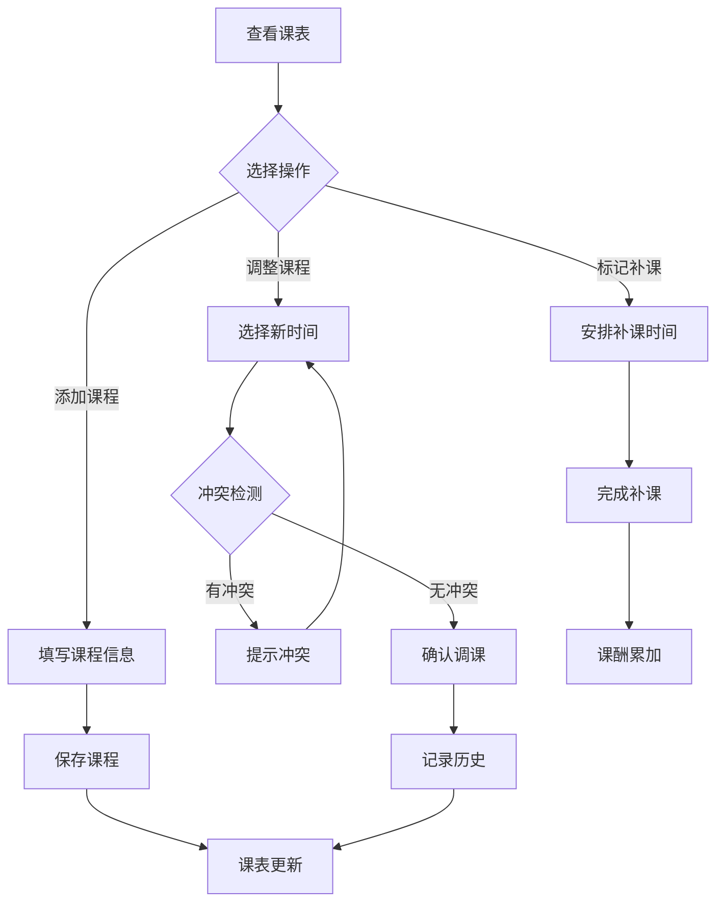

## 1. Product Overview
AI智能课表是一款面向教培机构教师的课表管理应用，解决调课困难、补课混乱、课酬计算繁琐的痛点，提供灵活的课程调度和自动课酬统计功能。

## 2. Core Features

### 2.1 User Roles
| Role | Registration Method | Core Permissions |
|------|---------------------|------------------|
| Teacher | Email registration | Manage courses, view income, adjust schedule |

### 2.2 Feature Module
1. **课表首页**: 周视图课表、今日课程概览
2. **课程管理**: 添加/编辑/删除课程、课程分类
3. **调课中心**: 一键调课、冲突检测、历史记录
4. **补课管理**: 标记需补课、安排补课、补课统计
5. **收入统计**: 课酬自动计算、收入趋势、明细查询
6. **设置**: 课程单价配置、个人信息

### 2.3 Page Details
| Page Name | Module Name | Feature description |
|-----------|-------------|---------------------|
| 课表首页 | 周视图课表 | 按周一到周日展示课程，支持正常课/补课/临时课三色区分 |
| 课表首页 | 今日概览 | 显示今日课程数量、预计收入、待办事项 |
| 课程管理 | 课程列表 | 展示所有课程，支持搜索和筛选 |
| 课程管理 | 添加课程 | 填写课程名称、时间、学生、单价等信息 |
| 调课中心 | 调课操作 | 选择课程调整时间，自动检测冲突 |
| 调课中心 | 调课记录 | 展示所有调课历史 |
| 补课管理 | 补课列表 | 展示需补课和已完成补课的记录 |
| 收入统计 | 收入概览 | 展示月/周收入、课程数量统计 |
| 收入统计 | 趋势图表 | 近6个月收入折线图 |
| 收入统计 | 收入明细 | 每节课的收入记录 |

## 3. Core Process

### 3.1 课程添加流程
教师进入课程管理 → 点击添加课程 → 填写课程信息 → 保存 → 课表自动更新

### 3.2 调课流程
教师查看课表 → 选择需要调整的课程 → 选择新时间 → 系统检测冲突 → 确认调课 → 记录调课历史

### 3.3 补课流程
学生请假 → 教师标记课程为"需补课" → 安排补课时间 → 完成补课 → 课酬自动结算

### 3.4 课酬计算流程
课程完成 → 系统自动累加课酬 → 教师查看收入统计 → 支持按月/周统计

## 4. User Interface Design

### 4.1 Design Style
- **主色调**: 深蓝色 (#1e3a5f) - 专业、稳重
- **辅助色**: 
  - 正常课: 蓝色 (#3b82f6)
  - 补课: 橙色 (#f97316)
  - 临时课: 绿色 (#22c55e)
- **按钮风格**: 圆角矩形，hover时有轻微放大效果
- **字体**: 标题使用 Inter 粗体，正文使用 Inter 常规
- **布局**: 卡片式布局，清晰的信息层级
- **图标**: 使用 Lucide React 图标库

### 4.2 Page Design Overview
| Page Name | Module Name | UI Elements |
|-----------|-------------|-------------|
| 课表首页 | 周视图课表 | 7列布局，每列代表一天；课程以彩色卡片显示，支持点击查看详情 |
| 课表首页 | 今日概览 | 顶部卡片区域，展示关键指标；数字使用大字体突出显示 |
| 课程管理 | 课程列表 | 卡片列表，每个卡片展示课程名称、时间、学生、单价；支持编辑/删除按钮 |
| 调课中心 | 调课操作 | 时间选择器、冲突提示弹窗、确认按钮 |
| 收入统计 | 趋势图表 | 使用 ECharts 渲染折线图，支持切换月/周视图 |

### 4.3 Responsiveness
- 桌面端: 完整周视图，侧边栏导航
- 平板端: 周视图紧凑显示，底部导航
- 移动端: 日视图为主，底部标签导航，支持滑动切换日期

### 4.4 交互设计
- 课程卡片: 点击展开详情，支持拖拽调整位置
- 调课操作: 时间选择时实时显示冲突提示
- 收入统计: 图表支持点击查看具体数据
- 动画效果: 页面切换使用淡入淡出，按钮hover有缩放效果
