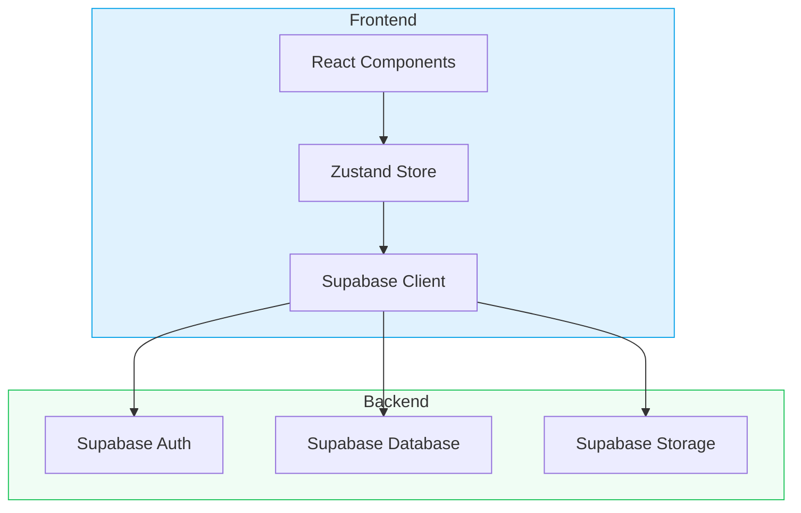
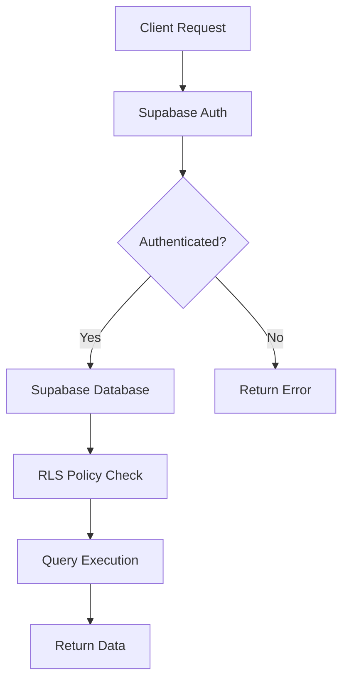
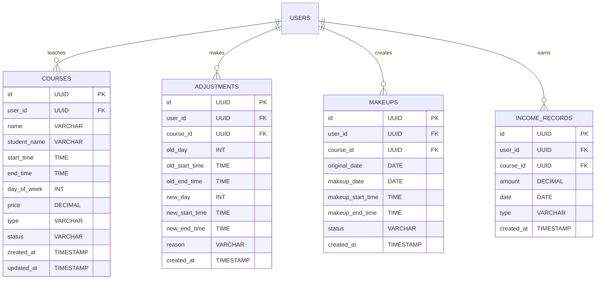

## 1. Architecture Design



## 2. Technology Description
- Frontend: React@18 + TypeScript + TailwindCSS@3 + Vite
- State Management: Zustand
- Routing: React Router DOM
- Charts: ECharts (echarts-for-react)
- Icons: Lucide React
- Backend: Supabase (Auth + PostgreSQL + Storage)

## 3. Route Definitions

| Route | Purpose |
|-------|---------|
| / | 课表首页（周视图） |
| /courses | 课程管理页面 |
| /adjust | 调课中心 |
| /makeup | 补课管理 |
| /income | 收入统计 |
| /settings | 设置页面 |

## 4. API Definitions (Supabase)

### 4.1 Courses Table API
- **GET /courses**: 获取所有课程
- **POST /courses**: 添加新课程
- **PUT /courses/:id**: 更新课程信息
- **DELETE /courses/:id**: 删除课程

### 4.2 Course Adjustments API
- **GET /adjustments**: 获取调课记录
- **POST /adjustments**: 添加调课记录

### 4.3 Makeup Classes API
- **GET /makeups**: 获取补课记录
- **POST /makeups**: 添加补课记录
- **PUT /makeups/:id**: 更新补课状态

### 4.4 Income Records API
- **GET /income**: 获取收入统计
- **GET /income/details**: 获取收入明细

## 5. Server Architecture Diagram



## 6. Data Model

### 6.1 Data Model Definition



### 6.2 Data Definition Language

```sql
CREATE TABLE courses (
    id UUID PRIMARY KEY DEFAULT gen_random_uuid(),
    user_id UUID REFERENCES auth.users(id) ON DELETE CASCADE,
    name VARCHAR(100) NOT NULL,
    student_name VARCHAR(100),
    start_time TIME NOT NULL,
    end_time TIME NOT NULL,
    day_of_week INT NOT NULL CHECK (day_of_week BETWEEN 0 AND 6),
    price DECIMAL(10, 2) NOT NULL DEFAULT 0,
    type VARCHAR(20) NOT NULL DEFAULT 'normal' CHECK (type IN ('normal', 'makeup', 'temporary')),
    status VARCHAR(20) NOT NULL DEFAULT 'scheduled' CHECK (status IN ('scheduled', 'completed', 'canceled', 'pending_makeup')),
    created_at TIMESTAMP DEFAULT NOW(),
    updated_at TIMESTAMP DEFAULT NOW()
);

CREATE TABLE adjustments (
    id UUID PRIMARY KEY DEFAULT gen_random_uuid(),
    user_id UUID REFERENCES auth.users(id) ON DELETE CASCADE,
    course_id UUID REFERENCES courses(id) ON DELETE CASCADE,
    old_day INT NOT NULL,
    old_start_time TIME NOT NULL,
    old_end_time TIME NOT NULL,
    new_day INT NOT NULL,
    new_start_time TIME NOT NULL,
    new_end_time TIME NOT NULL,
    reason VARCHAR(200),
    created_at TIMESTAMP DEFAULT NOW()
);

CREATE TABLE makeups (
    id UUID PRIMARY KEY DEFAULT gen_random_uuid(),
    user_id UUID REFERENCES auth.users(id) ON DELETE CASCADE,
    course_id UUID REFERENCES courses(id) ON DELETE CASCADE,
    original_date DATE NOT NULL,
    makeup_date DATE,
    makeup_start_time TIME,
    makeup_end_time TIME,
    status VARCHAR(20) NOT NULL DEFAULT 'pending' CHECK (status IN ('pending', 'scheduled', 'completed')),
    created_at TIMESTAMP DEFAULT NOW()
);

CREATE TABLE income_records (
    id UUID PRIMARY KEY DEFAULT gen_random_uuid(),
    user_id UUID REFERENCES auth.users(id) ON DELETE CASCADE,
    course_id UUID REFERENCES courses(id) ON DELETE CASCADE,
    amount DECIMAL(10, 2) NOT NULL,
    date DATE NOT NULL,
    type VARCHAR(20) NOT NULL CHECK (type IN ('normal', 'makeup', 'temporary')),
    created_at TIMESTAMP DEFAULT NOW()
);

CREATE INDEX idx_courses_user_id ON courses(user_id);
CREATE INDEX idx_courses_day_of_week ON courses(day_of_week);
CREATE INDEX idx_adjustments_user_id ON adjustments(user_id);
CREATE INDEX idx_makeups_user_id ON makeups(user_id);
CREATE INDEX idx_income_records_user_id ON income_records(user_id);
CREATE INDEX idx_income_records_date ON income_records(date);
```

### 6.3 RLS Policies

```sql
ALTER TABLE courses ENABLE ROW LEVEL SECURITY;
ALTER TABLE adjustments ENABLE ROW LEVEL SECURITY;
ALTER TABLE makeups ENABLE ROW LEVEL SECURITY;
ALTER TABLE income_records ENABLE ROW LEVEL SECURITY;

CREATE POLICY "Users can view their own courses" ON courses
    FOR SELECT USING (user_id = auth.uid());

CREATE POLICY "Users can insert their own courses" ON courses
    FOR INSERT WITH CHECK (user_id = auth.uid());

CREATE POLICY "Users can update their own courses" ON courses
    FOR UPDATE USING (user_id = auth.uid());

CREATE POLICY "Users can delete their own courses" ON courses
    FOR DELETE USING (user_id = auth.uid());

CREATE POLICY "Users can view their own adjustments" ON adjustments
    FOR SELECT USING (user_id = auth.uid());

CREATE POLICY "Users can insert their own adjustments" ON adjustments
    FOR INSERT WITH CHECK (user_id = auth.uid());

CREATE POLICY "Users can view their own makeups" ON makeups
    FOR SELECT USING (user_id = auth.uid());

CREATE POLICY "Users can insert their own makeups" ON makeups
    FOR INSERT WITH CHECK (user_id = auth.uid());

CREATE POLICY "Users can update their own makeups" ON makeups
    FOR UPDATE USING (user_id = auth.uid());

CREATE POLICY "Users can view their own income" ON income_records
    FOR SELECT USING (user_id = auth.uid());
```

### 6.4 Initial Data

```sql
INSERT INTO courses (user_id, name, student_name, start_time, end_time, day_of_week, price, type, status)
VALUES 
    ('<user_id>', '数学一对一', '张三', '09:00:00', '10:30:00', 1, 200.00, 'normal', 'scheduled'),
    ('<user_id>', '英语一对一', '李四', '14:00:00', '15:30:00', 2, 180.00, 'normal', 'scheduled'),
    ('<user_id>', '物理一对一', '王五', '10:00:00', '11:30:00', 3, 220.00, 'normal', 'scheduled'),
    ('<user_id>', '数学一对一', '赵六', '16:00:00', '17:30:00', 4, 200.00, 'normal', 'scheduled'),
    ('<user_id>', '化学一对一', '钱七', '09:00:00', '10:30:00', 5, 200.00, 'normal', 'scheduled'),
    ('<user_id>', '英语一对一', '孙八', '14:00:00', '15:30:00', 6, 180.00, 'temporary', 'scheduled'),
    ('<user_id>', '数学一对一', '张三', '16:00:00', '17:30:00', 0, 200.00, 'makeup', 'scheduled');
```
